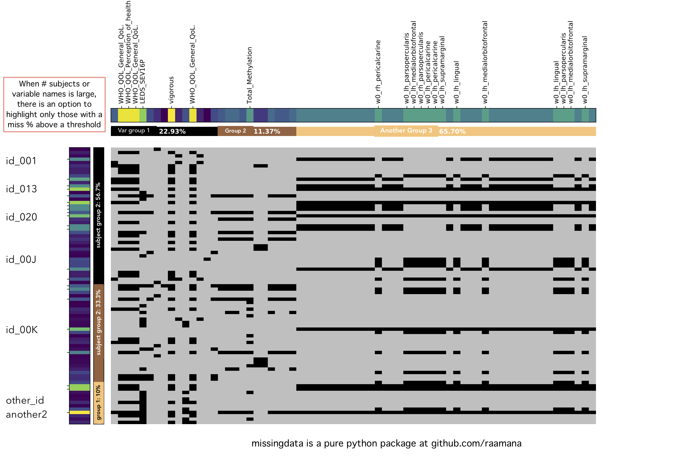

===========
missingdata
===========

.. image:: https://img.shields.io/pypi/v/missingdata.svg
        :target: https://pypi.python.org/pypi/missingdata

.. image:: https://zenodo.org/badge/DOI/10.5281/zenodo.3352336.svg
        :target: https://doi.org/10.5281/zenodo.3352336
        :alt: citation

.. image:: https://img.shields.io/travis/raamana/missingdata.svg
        :target: https://travis-ci.org/raamana/missingdata

.. image:: https://readthedocs.org/projects/missingdata/badge/?version=latest
        :target: https://missingdata.readthedocs.io/en/latest/?badge=latest
        :alt: Documentation Status

missing data visualization and imputation

Goals
--------

To provide an easy to use yet thorough assessment of missing values in one's dataset:

 - in addition to the blackholes plot bellow,
 - show the variable-to-variable, subject-to-subject co-missingness, and
 - quantify the TYPE of missingness etc

Note
~~~~~~~~~~~~~

    To easily manage your data with missing values etc, I strongly recommend you to move away from CSV files and start managing your data in self-contained flexible data structures like `pyradigm <http://github.com/raamana/pyradigm>`_, as your data, as well your needs, will only get bigger & more complicated e.g. with mixed-types, missing values and large number of groups.

These would be great contributions if you have time.

Features
--------

* visualization
* imputation (coming!)
* other handling

blackholes plot
~~~~~~~~~~~~~~~~

State
-------
 - Software is beta and under dev. **Update regularly and quite often!!**
 - Contributions most welcome, esp. reporting bugs and improving usability.

Installation
--------------

.. code-block:: bash

    pip install -U missingdata

Usage
------------

Let's say you have all the data in a pandas `DataFrame`, where subject IDs are in a ``'sub_ids'`` column
and variable names are in a ``'var_names'`` column, and they belong to groups identified by ``sub_class`` and ``var_group``,
you can use the following code produce the ``blackholes`` plot:

.. code-block:: python

    from missingdata import blackholes

    blackholes(data_frame,
               label_rows_with='sub_ids', label_cols_with='var_names',
               group_rows_by=sub_class, group_cols_by=var_group)

If you were interested in seeing subjects/variables with least amount of missing data, you can control miss perc window
with ``filter_spec_samples`` and/or ``filter_spec_variables`` by passing a tuple of two floats e.g. (0, 0.1) which
will filter away those with more than 10% of missing data.

.. code-block:: python

    from missingdata import blackholes

    blackholes(data_frame,
               label_rows_with='sub_ids', label_cols_with='var_names',
               filter_spec_samples=(0, 0.1))

The other parameters for the function are self-explanatory.

Please open an `issue <https://github.com/raamana/missingdata/issues/new>`_
if you find something confusing, or have feedback to improve, or identify a bug. **Thanks**.

Citation
----------------

If you find this package useful, I'd greatly appreciate if cite this package via:

.. parsed-literal::

    Pradeep Reddy Raamana, (2019), "missingdata python library" (Version v0.1). Zenodo. http://doi.org/10.5281/zenodo.3352336
    DOI: 10.5281/zenodo.3352336
